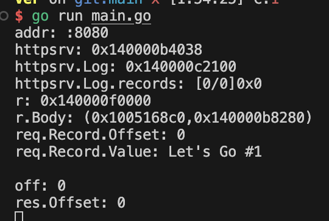
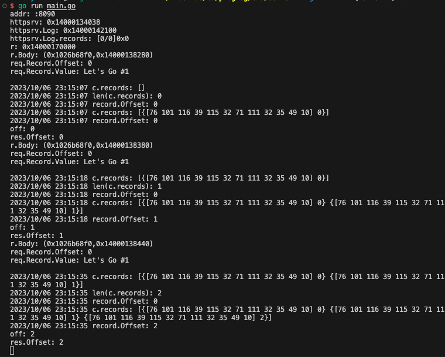

## test
```
curl -X POST localhost:8080 -d \
'{"record": {"value": "TGV0J3MgR28gIzEK"}}'

curl -X POST localhost:8080 -d \
'{"record": {"value": "TGV0J3MgR28gIzIK"}}'

curl -X POST localhost:8080 -d \
'{"record": {"value": "TGV0J3MgR28gIzMK"}}'
```

動作確認例
```
# ~/Practice/Go/proglog on git:main 
$ curl -X POST localhost:8080 -d \
'{"record": {"value": "TGV0J3MgR28gIzEK"}}'
{"offset":0}

# ~/Practice/Go/proglog on git:main
$ curl -X POST localhost:8080 -d \
'{"record": {"value": "TGV0J3MgR28gIzIK"}}'
{"offset":1}

# ~/Practice/Go/proglog on git:main
$ curl -X POST localhost:8080 -d \
'{"record": {"value": "TGV0J3MgR28gIzMK"}}'
{"offset":2}
```

呼べば呼ぶだけカウントされていくみたい
```
同じvalueで何度か実行した例
curl -X POST localhost:8080 -d \
'{"record": {"value": "TGV0J3MgR28gIzEK"}}'
{"offset":0}

curl -X POST localhost:8080 -d \
'{"record": {"value": "TGV0J3MgR28gIzEK"}}'
{"offset":1}

curl -X POST localhost:8080 -d \
'{"record": {"value": "TGV0J3MgR28gIzEK"}}'
{"offset":2}

```


GETもできる?
```
curl -X GET localhost:8080 -d \
'{"record": {"value": "TGV0J3MgR28gIzEK"}}'
{"record":{"value":"TGV0J3MgR28gIzEK","offset":0}}
```


#### req.Record.Value: Let's Go #1 発見


#### 実行結果がわかりやすいスクショ


## まとめ
- 今回は、GoでのHTTPサーバーを作ってみた
- muxを使って、ルーティングを設定した
  - ルーティングとは、リクエストを処理するハンドラー関数を決めること
  - ハンドラー関数とは、リクエストを受け取ってレスポンスを返す関数
  - ハンドラー関数を作成するには、http.HandlerFunc型の関数を作成する
- ハンドラー関数を作成して、リクエストを処理してみた
- リクエストのボディを読み込んで、レスポンスを返してみた
- Decode関数を使って、リクエストのボディを構造体に変換してみた
- Encode関数を使って、構造体をレスポンスのボディに変換してみた
- go.modを使って、importできる状態にしてみた
